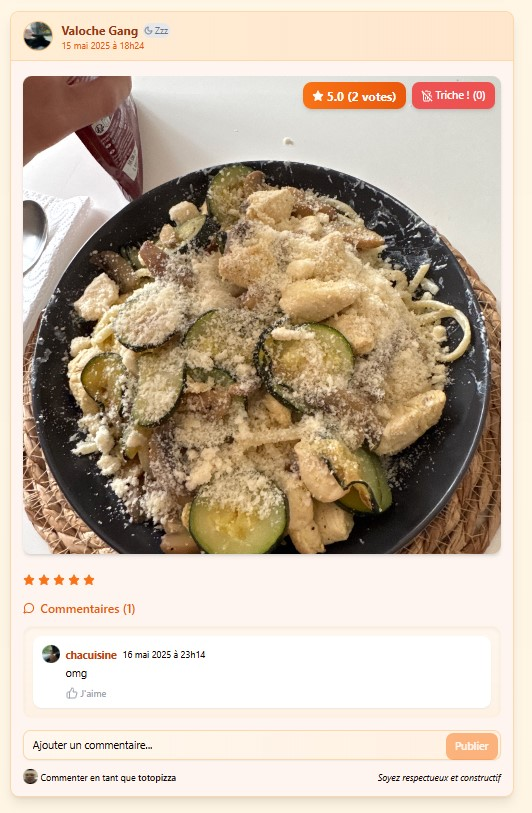
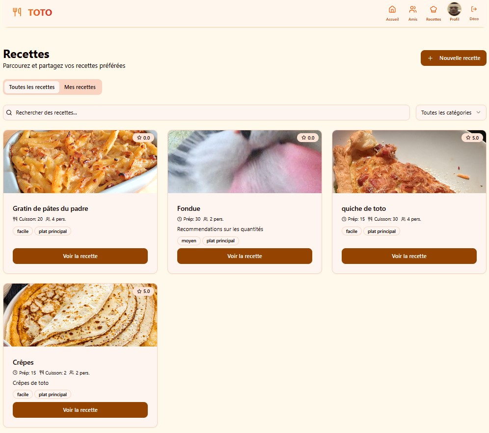
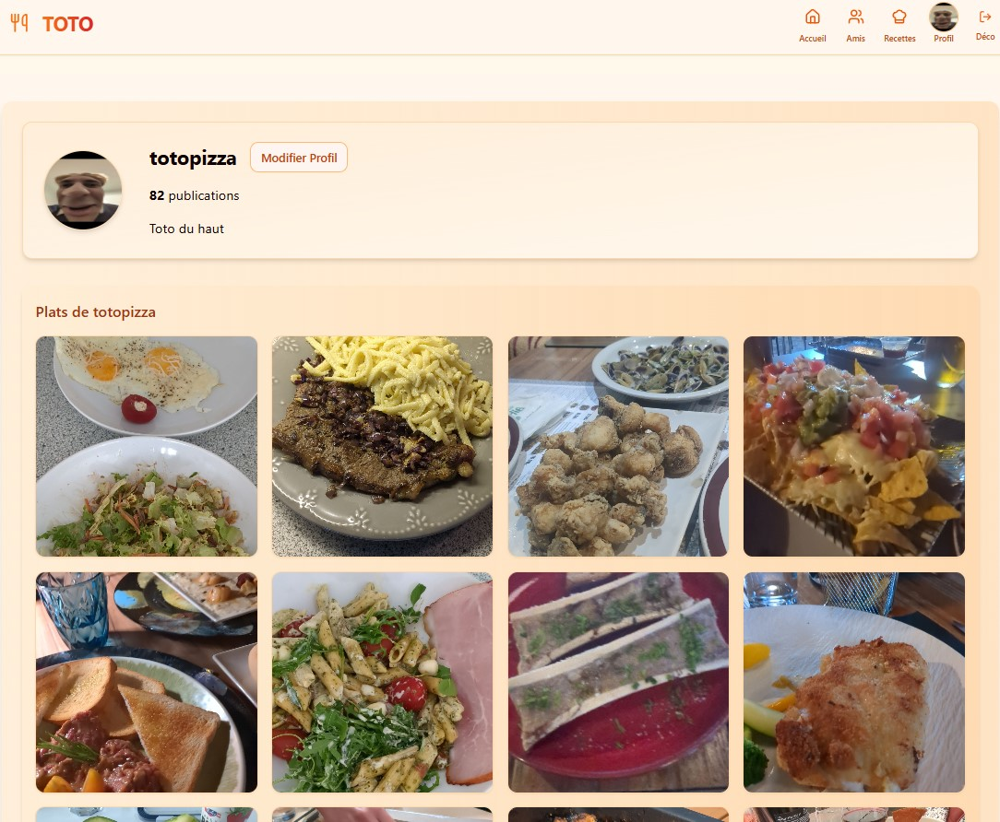
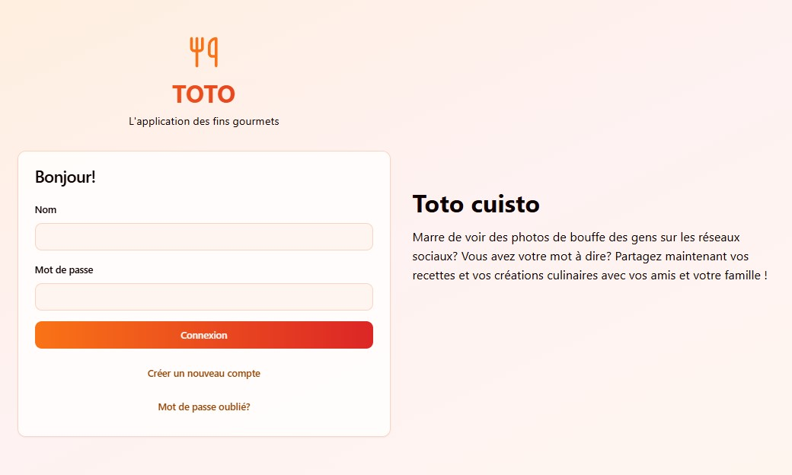

# 🍴 Toto — L'application des fins gourmets

**Share culinary experiences. Browse what your friends and family have cooked. Review their recipes.**

Tired of seeing food pics buried in your social feed with nowhere to leave a real opinion? Toto is the place built just for that — share your dishes, follow the people you cook for (and with), and rate each other's recipes for real.

---

## ✨ What you can do

### 📸 Post your dishes
Snap a photo of what you cooked and share it with your circle, comments included.

<p align="center">
  
</p>

### 👀 Browse and rate
Every dish gets star ratings from the people who matter — friends and family, not strangers.

### 📖 Save and share recipes
Turn your best dishes into full recipes — prep time, difficulty, servings, the works — and let others cook them too.

<p align="center">
  
</p>

### 🧑‍🍳 Your own cooking profile
Every meal you've ever posted, all in one place. Build your culinary track record, one plate at a time.

<p align="center">
  
</p>

---

## 🚀 Get started

```bash
npm install
npm run db:push
npm run dev
```

Open **http://localhost:5000** and start cooking. See [RUNNING_LOCALLY.md](RUNNING_LOCALLY.md) for the full setup guide.

---

<p align="center">
  
</p>

<p align="center"><i>Marre de voir des photos de bouffe des gens sur les réseaux sociaux ? Partagez vos recettes et vos créations culinaires avec vos amis et votre famille.</i></p>
